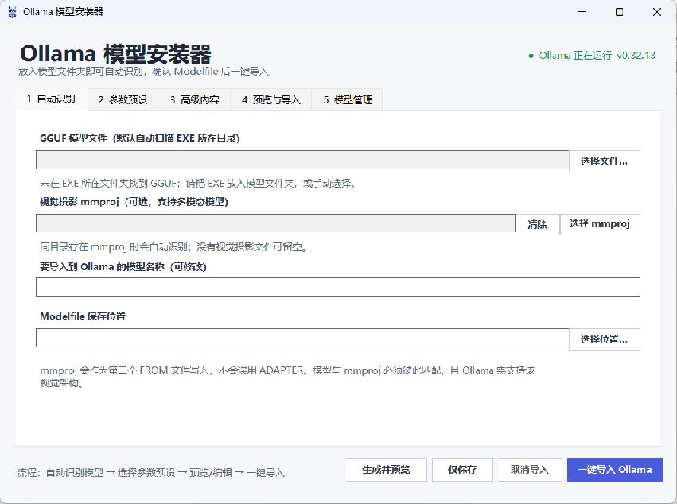

<div align="center">
  

# Ollama 模型安装器

**把本地 GGUF 模型轻松导入 Ollama 的 Windows 图形工具**

[](https://github.com/kadonevir/ollama-model-installer/releases/latest)
[](https://github.com/kadonevir/ollama-model-installer/releases)


[**下载最新版本**](https://github.com/kadonevir/ollama-model-installer/releases/latest/download/OllamaModelInstaller.exe) · [查看所有版本](https://github.com/kadonevir/ollama-model-installer/releases)

</div>

无需手写命令。把 EXE 放到模型目录，程序会自动识别 GGUF 和 mmproj、生成可编辑的 Modelfile，并引导你一键完成导入。

## 软件界面



## 主要功能

| 功能 | 说明 |
| --- | --- |
| 自动识别模型 | 扫描 EXE 所在目录，也支持手动选择或拖入 GGUF |
| mmproj 多模态支持 | 自动识别同目录的 `mmproj` / `projector` GGUF，并作为第二个 `FROM` 导入 |
| Modelfile 编辑器 | 自动生成、实时预览，也可以直接修改最终内容 |
| 参数预设 | 提供基础、中级、高级三档，可继续逐项调整 |
| 上下文选择 | 支持 4K、8K、16K、32K、64K、128K、256K，写入时自动转换为数字 |
| 自定义参数 | 参数名、值和中文说明可直接在表格中编辑、添加或删除 |
| Ollama 服务检测 | 显示运行状态和版本，未运行时可自动启动 `ollama serve` |
| 一键导入 | 实时显示 `ollama create` 日志，并支持取消 |
| 模型管理 | 查看已安装模型的大小、架构和量化信息，确认后可删除 |
| 高 DPI 界面 | 支持 Per-Monitor V2，适配高分屏和多显示器 |

可配置的常用参数包括：`num_ctx`、`temperature`、`top_k`、`top_p`、`min_p`、`repeat_penalty`、`repeat_last_n`、`num_predict`、`seed` 和 `stop`。高级内容支持 `SYSTEM`、`TEMPLATE`、`LICENSE`、`REQUIRES` 及任意附加指令。

## 快速开始

1. 电脑上先安装并运行 [Ollama](https://ollama.com/download)。
2. 从 [Releases](https://github.com/kadonevir/ollama-model-installer/releases/latest) 下载 `OllamaModelInstaller.exe`。
3. 把 EXE 复制到下载好的 GGUF 模型文件夹并运行。
4. 确认自动识别的文件和“要导入到 Ollama 的模型名称”。
5. 选择参数预设，在“预览与导入”中检查或编辑 Modelfile。
6. 点击“一键导入 Ollama”。

导入成功后可以运行：

```powershell
ollama run 你的模型名称
```

## 运行要求

- Windows 10 或 Windows 11
- 已安装 Ollama
- 一个受当前 Ollama 版本支持的 GGUF 模型
- 使用大上下文或大型模型时，需要足够的内存或显存

## mmproj 与分片模型

- mmproj 必须与主模型架构和版本匹配，是否能处理图片仍取决于 Ollama 对该视觉架构的支持。
- 同目录有多个主模型时，程序优先选择分片模型的第一片，否则选择体积最大的 GGUF；可在界面中手动更换。
- 程序将主模型和 mmproj 写成两个 `FROM`，不会把视觉投影误用为 LoRA `ADAPTER`。

## 隐私与安全

- 程序只与本机 Ollama 默认接口 `127.0.0.1:11434` 通信。
- 不包含账号系统、遥测或数据上传功能。
- 模型删除操作必须由用户选中模型并再次确认。
- 当前 EXE 未进行商业代码签名，Windows 可能显示未知发布者提示。你可以阅读源码并自行构建。

## 从源码构建

项目使用 Windows 原生 .NET Framework / WinForms，不需要第三方构建依赖。在 PowerShell 中运行：

```powershell
.\build.ps1
```

输出文件位于：

```text
dist\Ollama模型安装器.exe
```

## English

Ollama Model Installer is a lightweight, single-file Windows GUI for importing local GGUF and mmproj models into Ollama. It provides Modelfile presets and editing, service detection, live import logs, high-DPI support, and installed-model management.

Download the latest executable from the [Releases page](https://github.com/kadonevir/ollama-model-installer/releases/latest).
